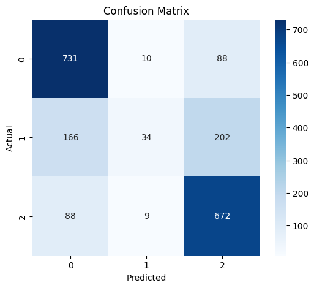
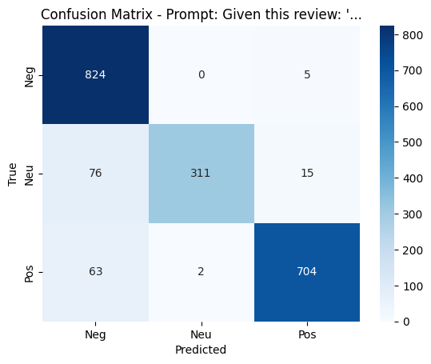

# Prompt Tuning for Sentiment Analysis

This project explores and compares two parameter-efficient fine-tuning techniques: **Soft Prompt Tuning** with BERT and **Hard Prompt Tuning** with DistilGPT-2. Both methods are applied to a sentiment analysis task on the Yelp review dataset.

This repository contains the implementation for the first assignment of the "Natural Language Processing" course at Amirkabir University of Technology (Spring 2024), under the supervision of Dr. Momtazi.

## Table of Contents
- [Project Overview](#project-overview)
- [Dataset](#dataset)
- [Methods Implemented](#methods-implemented)
  - [1. Soft Prompt Tuning with BERT](#1-soft-prompt-tuning-with-bert)
  - [2. Hard Prompt Tuning with DistilGPT-2](#2-hard-prompt-tuning-with-distilgpt-2)
- [Results & Analysis](#results--analysis)
- [Project Structure](#project-structure)
- [How to Run](#how-to-run)
- [Dependencies](#dependencies)
- [Acknowledgments](#acknowledgments)

## Project Overview

Instead of fine-tuning all the parameters of a large language model, which is computationally expensive, this project investigates more efficient methods:

1.  **Soft Prompt Tuning**: Involves freezing the pre-trained model and training only a small set of continuous "virtual token" embeddings that are prepended to the input sequence.
2.  **Hard Prompt Tuning**: Involves fine-tuning a model on manually crafted text templates (prompts) that rephrase the task in a text-to-text format.

The goal is to classify Yelp reviews into three sentiment categories: **Negative**, **Neutral**, and **Positive**.

## Dataset

The project uses the **Yelp Reviews** dataset. The original 1-5 star ratings have been preprocessed into three classes:
- **Negative (Class 0):** 1 and 2-star reviews
- **Neutral (Class 1):** 3-star reviews
- **Positive (Class 2):** 4 and 5-star reviews

The dataset is split into three files:
- `train.csv`: 10,000 samples
- `val.csv`: 2,000 samples
- `test.csv`: 2,000 samples

## Methods Implemented

### 1. Soft Prompt Tuning with BERT

This approach is implemented in `softpt.ipynb`.

-   **Model**: `bert-base-uncased`.
-   **Method**: The entire BERT model's parameters are frozen. A set of **10 continuous "virtual tokens"** are prepended to the input embeddings. Only these virtual tokens and a final linear classifier head are trained. This allows the model to adapt to the sentiment analysis task without updating its core parameters.
-   **Loss Function**: The model is trained using a standard `CrossEntropyLoss` on the classifier's output.

#### Final Test Results (Soft Prompt Tuning)
| Metric             | Score  |
| ------------------ | ------ |
| **Accuracy**       | 0.7185 |
| **Weighted F1**    | 0.6626 |
| **Weighted Precision** | 0.7051 |
| **Weighted Recall**    | 0.7185 |

**Per-Class Metrics:**
| Class     | Precision | Recall | F1-Score |
| --------- | --------- | ------ | -------- |
| 0 (Negative) | 0.7421    | 0.8818 | 0.8060   |
| 1 (Neutral)  | 0.6415    | 0.0846 | 0.1495   |
| 2 (Positive) | 0.6985    | 0.8739 | 0.7764   |



### 2. Hard Prompt Tuning with DistilGPT-2

This approach, implemented in `hardpt.ipynb`, fine-tunes a decoder-only model using different prompt templates.

-   **Model**: `distilgpt2` (a smaller version of GPT-2).
-   **Method**: The model is trained to classify sentiment by formatting the input as a prompt. Three different templates were tested, and the model was fine-tuned on each to find the best-performing prompt.

-   **Prompts Tested**:
    1.  `Evaluate the sentiment: '{}' Sentiment: {}`
    2.  `Review says: '{}' -> The sentiment is {}.`
    3.  `Given this review: '{}' we determine the sentiment as {}.`

The best performance was achieved with the prompt: **`Review says: '{}' -> The sentiment is {}.`**

#### Final Test Results (Hard Prompt Tuning - Best Prompt)
| Metric             | Score  |
| ------------------ | ------ |
| **Accuracy**       | 0.9220 |
| **Weighted F1**    | 0.9208 |
| **Weighted Precision** | 0.9225 |
| **Weighted Recall**    | 0.9220 |



## Results & Analysis

-   **Performance Comparison**: Hard Prompt Tuning with `distilgpt2` (**~92% accuracy**) significantly outperformed Soft Prompt Tuning with `bert-base-uncased` (**~72% accuracy**). This suggests that for this task and model combination, reformulating the problem as a generative, text-to-text task was more effective.
-   **Class-wise Performance**:
    -   The **Soft Prompt Tuning** model struggled significantly with the **Neutral** class, achieving a very low F1-score of 0.15. It performed well on Negative and Positive classes.
    -   The **Hard Prompt Tuning** model demonstrated strong and balanced performance across all three classes, indicating a more robust understanding of the sentiment nuances.

## Project Structure
```
.
├── hardpt.ipynb        # Jupyter Notebook for Hard Prompt Tuning with DistilGPT-2
├── softpt.ipynb        # Jupyter Notebook for Soft Prompt Tuning with BERT
├── assignment.pdf      # The original assignment description (in Persian)
├── hardpt.png          # Confusion matrix for the hard prompt model
├── softpt.png          # Confusion matrix for the soft prompt model
└── readme.md           # This file
```

## How to Run

1.  **Clone the repository:**
    ```bash
    git clone https://github.com/your-username/Prompt-Tuning-for-Sentiment-Analysis.git
    cd Prompt-Tuning-for-Sentiment-Analysis
    ```
2.  **Install dependencies:**
    ```bash
    pip install -r requirements.txt
    ```
3.  **Dataset:** Download the Yelp review dataset and place `train.csv`, `val.csv`, and `test.csv` in the project's root directory or update the file paths in the notebooks.

4.  **Run Notebooks:** Open and run the cells in `softpt.ipynb` and `hardpt.ipynb` using Jupyter Notebook or Google Colab.

## Dependencies
The project requires the following libraries:
```
torch
pandas
transformers
scikit-learn
matplotlib
seaborn
```
You can install them via `pip install -r requirements.txt`.

## Acknowledgments
-   **Course**: Natural Language Processing
-   **University**: Amirkabir University of Technology
-   **Instructor**: Dr. Momtazi
-   **Teaching Assistant**: Fahimeh Behzadi
